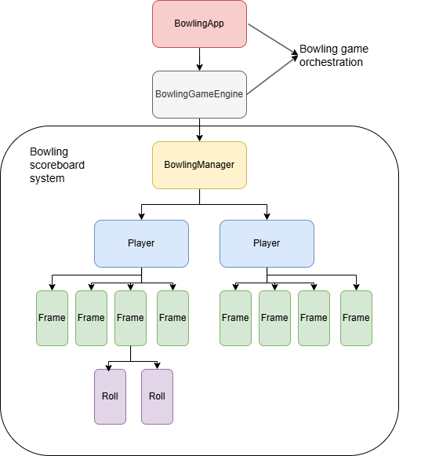

## Bowling Scoreboard

The organization of a bowling scoreboard can be compared to that of an army: it's hierarchical, and orders flow from the top to the bottom. This makes it perfect for the application of the Composite structural design pattern.

The Composite design pattern allows you to compose objects into tree structures to represent hierarchies. It lets clients treat individual objects and compositions of objects uniformly, making it easier to work with recursive structures like a game with frames and rolls.

By using this pattern, requests made by the BowlingGameEngine can be received by the BowlingManager (or scoreboard) and passed down to the lower levels of the hierarchy, such as Frames and Rolls. This allows the BowlingManager to, for example, calculate player scores by delegating the task to the Player, that delegate it to the Frames, which in turn delegate it to the Rolls. Thus, the calculated score of the player would be the aggregation of the scores calculated by its subordinates.

The diagram below illustrates this implementation with classes, in an Object Oriented Approach. It highlights the class hierarchy and the flow of responsibilities in the system.



The BowlingApp class serves as the game's entry point, using the BowlingGameEngine to manage gameplay flow alongside the BowlingManager. The BowlingManager, in its turn, delegates tasks to the Players, that rely on Frames and Rolls to manage the scores.


### Repository structure
The struture of the repository is detailed below:

```plaintext
- /src/game: the bowling game CLI application for testing the scoreboard solution
- /src/helpers: helper functions to get user inputs and print results
- /src/score: the actual implementation of the solution to the coding challenge (bowling scoreboard)
- /tests: tests to assert the correctness of the solution.
```

### Testing
To test the solution, run the `main.py` file from the root of the directory. This will launch the BowlingApp, which is a CLI application that allows the user to input roll scores and test the functioning of the BowlingManager (scoreboard).

This repository also includes feature tests written with `pytest` to ensure the correctness of the solution. To run the tests, navigate to the project root and use the following command:

```bash
pytest tests/tests.py
```